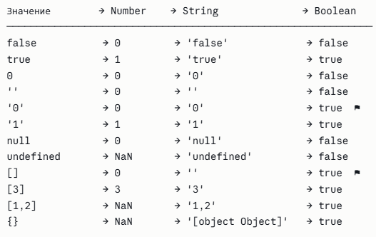

# Типы данных JS, приведение типов

В JavaScript 8 типов данных. 7 примитивных и 1 объектный:

**Примитивы:**

* `string` — строка

* `number` — число (включая `Infinity`, `-Infinity`, `NaN`)

* `boolean` — `true` / `false`

* `null` — намеренное отсутствие значения

* `undefined` — значение не присвоено

* `symbol` — уникальный идентификатор (ES6)

* `bigint` — целые числа произвольной точности (ES2020)

**Объектный тип:**

* `object` — объекты, массивы, функции, `null` (исторический баг)

#### Примитивы vs Объекты

#|
||

|

Примитивы

|

Объекты

||
||

Хранение

|

По значению

|

По ссылке

||
||

Передача

|

Копия значения

|

Копия ссылки

||
||

Изменяемость

|

Иммутабельны

|

Мутабельны

||
||

Сравнение

|

По значению

|

По ссылке

||
||

Память

|

Стек (как правило)

|

Куча

||
|#

---

### null и undefined

**`undefined`** — переменная объявлена, но значение не присвоено. Это дефолтное состояние: возвращается из функции без `return`, у несуществующего свойства объекта, у параметра функции, если аргумент не передан.

**`null`** — явное, намеренное «пусто». Программист сам ставит `null`, чтобы сказать: «здесь значения нет, и это сделано специально».

```javascript
typeof undefined // "undefined"
typeof null      // "object"  ← исторический баг, не исправляют ради обратной совместимости

null == undefined   // true  (абстрактное равенство)
null === undefined  // false (строгое равенство)
```

`null` — единственное значение, которое `== undefined` и не `==` ничему другому.

---

### Symbol

`Symbol` — примитив, гарантированно уникальный. Даже два символа с одним описанием не равны друг другу:

```javascript
Symbol('id') === Symbol('id') // false
```

#### Зачем нужен

1\. Уникальные ключи объекта (самый частый)

Представь: ты пишешь библиотеку и хочешь добавить своё свойство к чужому объекту. Если назовёшь его `id` или `type` — рискуешь затереть свойство, которое уже есть. Символ решает это:

```javascript
const _secret = Symbol('secret')

const obj = { name: 'Маша' }
obj[_secret] = 'внутренние данные библиотеки'

obj['secret']   // undefined — строковый ключ другой!
obj[_secret]    // 'внутренние данные библиотеки' — работает
```

2\. «Невидимые» свойства

Символьные ключи намеренно скрыты от стандартных методов обхода:

```javascript
const id = Symbol('id')
const user = { name: 'Вася', [id]: 123 }

Object.keys(user)         // ['name']     — символа нет
for (let k in user) {}   // только 'name'
JSON.stringify(user)      // {"name":"Вася"} — символ потерян

// Найти символы можно только специально:
Object.getOwnPropertySymbols(user) // [Symbol(id)]
```

Это полезно, когда библиотека хочет хранить метаданные в объекте, не мешая пользователю.

3\. Well-known Symbols (зашиты в спецификацию ECMAScript) — хуки в движок JS

Это самая мощная часть. JS использует встроенные символы, чтобы дать тебе возможность переопределить стандартное поведение объектов.

```javascript
// Сделать объект итерируемым (работает в for...of)
class Range {
  constructor(from, to) {
    this.from = from
    this.to = to
  }

  [Symbol.iterator]() {
    let current = this.from
    const last = this.to
    return {
      next() {
        return current <= last
          ? { value: current++, done: false }
          : { done: true }
      }
    }
  }
}

for (const n of new Range(1, 3)) {
  console.log(n) // 1, 2, 3
}
```

Другие well-known символы: `Symbol.toPrimitive` (как объект приводится к числу или строке), `Symbol.hasInstance` (переопределяет `instanceof`), `Symbol.toStringTag` (меняет `[object ...]`).

**Symbol() vs Symbol.for()**

```javascript
// Symbol() — всегда новый, приватный, нигде не зарегистрирован
Symbol('x') === Symbol('x') // false

// Symbol.for() — использует глобальный реестр
Symbol.for('x') === Symbol.for('x') // true!
```

`Symbol.for` удобен, когда тебе нужен один и тот же символ в разных местах приложения (например, в разных модулях). Работает даже между разными iframe/workers — у них общий реестр.

```javascript
// модуль A
const TOKEN = Symbol.for('app.token')

// модуль B (совсем другой файл)
const TOKEN = Symbol.for('app.token')

// это один и тот же символ!
```

---

### BigInt

Добавлен в ES2020. `number` хранит числа в формате IEEE 754 double (64 бит), что даёт точные целые только до `2^53 - 1` (`Number.MAX_SAFE_INTEGER`). За этой границей теряется точность.

```
9007199254740991 + 1 === 9007199254740992 // true
9007199254740991 + 2 === 9007199254740992 // true (!)

9007199254740991n + 2n === 9007199254740993n // true — BigInt точен
```

**Ограничения:** нельзя смешивать `BigInt` и `number` в арифметике без явного приведения. `Math.*` методы не работают с `BigInt`. Нет дробной части.

---

### Boxing примитивов

Когда вы обращаетесь к методу или свойству примитива — JS временно оборачивает его в объект-обёртку (`String`, `Number`, `Boolean`), вызывает метод, и тут же уничтожает обёртку.

```javascript
"hello".toUpperCase() // JS создаёт new String("hello"), вызывает метод, выбрасывает объект
(42).toFixed(2)       // аналогично с Number
```

Поэтому нельзя добавить свойство примитиву — обёртка одноразовая:

```javascript
let s = "hello"
s.foo = 42
console.log(s.foo) // undefined
```

`null` и `undefined` — boxing не поддерживают, поэтому `null.foo` бросает TypeError.

---

### Строгое и нестрогое неравенство (== vs ===)

**`===` (strict equality)** — сравнивает тип и значение, без приведений. Исключение: `NaN !== NaN`.

**`==` (abstract equality)** — применяет алгоритм приведения типов (Abstract Equality Comparison):

Когда JavaScript видит a == b, он делает примерно следующее:

1. **Если типы одинаковые** — просто сравнивает значения (как ===).

2. **Если один null, а другой undefined** → сразу true.

3. **Если один из операндов — boolean**:

   * true превращается в 1

   * false превращается в 0

   * И сравнение начинается заново.

4. **Если один — строка, а другой — число**:

   * Строку пытаются превратить в число

   * Потом сравнивают два числа.

5. **Если один — объект, а другой — примитив** (строка/число/boolean):

   * Объект сначала превращают в примитив (обычно через .valueOf() или .toString())

   * Потом снова запускают сравнение уже с этим примитивом.

6. Во всех остальных случаях → false.

```
[] == false   // true: [] → "" → 0, false → 0
[] == ![]     // true (!!)
"0" == false  // true: "0" → 0, false → 0
"" == false   // true
```

---

### Truthy и Falsy

**Falsy значений всего 8:**

```
false, 0, -0, 0n, "", '', ``, null, undefined, NaN
```

Всё остальное — truthy, включая:

```
"0"      // truthy!
[]       // truthy!
{}       // truthy!
-1       // truthy
"false"  // truthy
```

---

### Object.is

Алгоритм SameValue — похож на `===`, но исправляет два исторических поведения:

```javascript
Object.is(NaN, NaN) // true  (=== даёт false)
Object.is(0, -0)    // false (=== даёт true)
Object.is(+0, -0)   // false
```

Используется внутри движка для `Map`, `Set`, `Array.prototype.includes`, алгоритма React для сравнения пропсов.

---

### Приведение типов

**Явное:** `Number()`, `String()`, `Boolean()`, `parseInt()`, `parseFloat()`

**Неявное — числовой контекст:**

```
+"3"     // 3
+true    // 1
+null    // 0
+undefined // NaN
+[]      // 0
+{}      // NaN
```

**Неявное — строковый контекст** (`+` с одним операндом-строкой):

```
1 + "2"   // "12"
"3" - 1   // 2 (- только числовой)
```

#### Алгоритм ToPrimitive — как объект становится примитивом

Когда JS нужно привести объект к примитиву, он делает так:

1. Есть Symbol.toPrimitive? → вызвать его с хинтом
2. Хинт 'string'? → сначала toString(), потом valueOf()
3. Хинт 'number' или 'default'? → сначала valueOf(), потом toString()
4. Ничего не вернуло примитив → TypeError

```javascript
const obj = {
  valueOf()  { return 42 },
  toString() { return 'привет' }
}

obj + 1     // 43       — valueOf() вернул 42
`${obj}`    // 'привет' — строковый хинт, toString()

// У массива:
// valueOf() возвращает сам массив (не примитив)
// toString() возвращает элементы через запятую
[1,2,3].toString()  // '1,2,3'
[].toString()       // ''
```

**Шпаргалка — что во что приводится**

