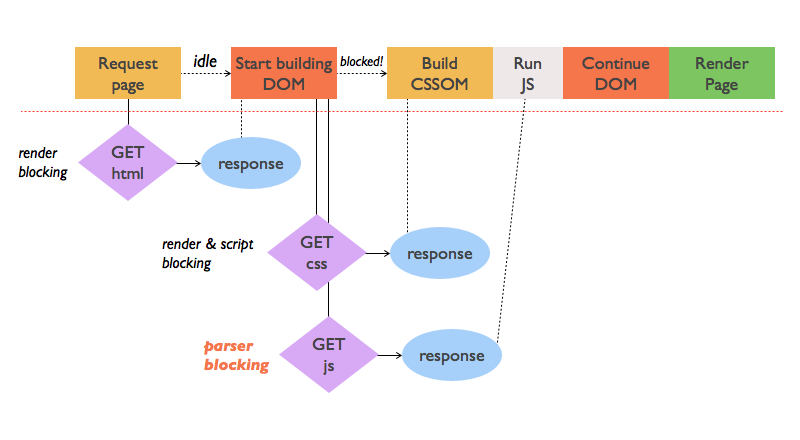

# Критический путь рендеринга

Процесс рендеринга от HTML и CSS до визуализации на экране включает несколько ключевых этапов, которые выполняет браузер, чтобы превратить код веб-страницы в видимое и интерактивное содержимое. Рассмотрим этот процесс шаг за шагом:

    

**1. Парсинг HTML и CSS**

**Парсинг HTML**

* **Получение HTML-документа**: Браузер получает HTML-код от сервера.

* **Создание DOM (Document Object Model)**: Браузер последовательно обрабатывает HTML, создавая **DOM-дерево** — иерархическую структуру, которая представляет каждый элемент HTML-документа как объект.

**Парсинг CSS**

* **Получение CSS**: Параллельно с HTML, браузер загружает CSS-файлы (или стили, встроенные в HTML).

* **Создание CSSOM (CSS Object Model)**: CSS-файлы также парсятся в виде **CSSOM-дерева**, которое описывает стили для каждого элемента.

Создаст дерево стилей, где каждый узел описывает применяемые стили для элементов.

**2. Создание рендер-дерева (Render Tree)**

* **Объединение DOM и CSSOM**: На этом этапе браузер объединяет DOM и CSSOM в **рендер-дерево**. В отличие от DOM, рендер-дерево содержит только те узлы, которые видны на странице, и применяет к ним стили.

Например, элементы с display: none не включаются в рендер-дерево.

* DOM: полный документ.

* CSSOM: применяемые стили.

* **Рендер-дерево**: включает видимые элементы, такие как текст, блоки, изображения, а также стили, которые на них применены.

**3. Выявление геометрии элементов (Layout или Reflow)**

* **Вычисление расположения элементов**: Браузер вычисляет точные размеры и положение каждого элемента на странице (ширину, высоту, отступы и границы) на основе рендер-дерева.

На этом этапе важно учитывать такие свойства, как width, height, margin, padding и другие.

**4. Отрисовка (Paint)**

* **Отрисовка элементов**: Браузер начинает процесс **отрисовки**, заполняя каждый элемент цветами, границами, фоном, текстом и изображениями. На этом этапе все стили применяются для каждого узла рендер-дерева.

Этот процесс управляется на уровне пикселей, то есть браузер решает, какие пиксели нужно закрасить в тот или иной цвет.

**5. Слои и компоновка (Compositing)**

* **Создание слоёв**: Браузер может создавать отдельные слои для элементов, например, тех, что используют 3D-трансформации или аппаратное ускорение. Эти слои отрисовываются независимо друг от друга.

  * Например, элемент с transform: translateZ(0) создаст отдельный слой, чтобы его трансформация могла выполняться на GPU.

* **Композиция слоёв**: После отрисовки всех слоёв браузер объединяет их в единую картинку. Этот процесс называется **compositing**. Слои могут изменяться независимо от друг друга без необходимости перерисовки всей страницы, что ускоряет анимации и взаимодействие с интерфейсом.

**6. Отправка на экран**

* После того, как все элементы рендеринга готовы и объединены в одно изображение, браузер отправляет результат на экран пользователя. Это происходит с помощью графического процессора (GPU), который отвечает за вывод изображения на дисплей.

## [**Оптимизация CRP**](https://developer.mozilla.org/ru/docs/Web/Performance/Guides/Critical_rendering_path#%D0%BE%D0%BF%D1%82%D0%B8%D0%BC%D0%B8%D0%B7%D0%B0%D1%86%D0%B8%D1%8F_crp) {#оптимизация_crp}

Улучшайте загрузку страницы с помощью приоритизации ресурсов, с помощью контролирования порядка, в котором они грузятся и с помощью уменьшения размеров файлов. Главные подсказки здесь:

1. Уменьшайте количество критических ресурсов, откладывая их загрузку, помечая их как async и/или группируя их;

2. Оптимизируйте количество необходимых запросов, а так же размеры файлов;

3. Оптимизируйте порядок так, чтобы критические ресурсы загружались в первую очередь, сокращая таким образом длину критических этапов рендеринга.