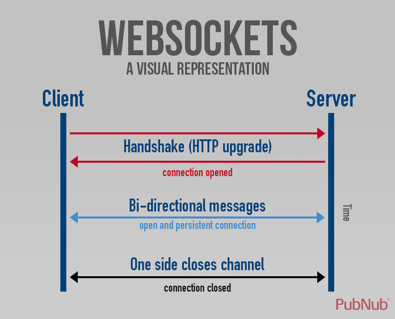
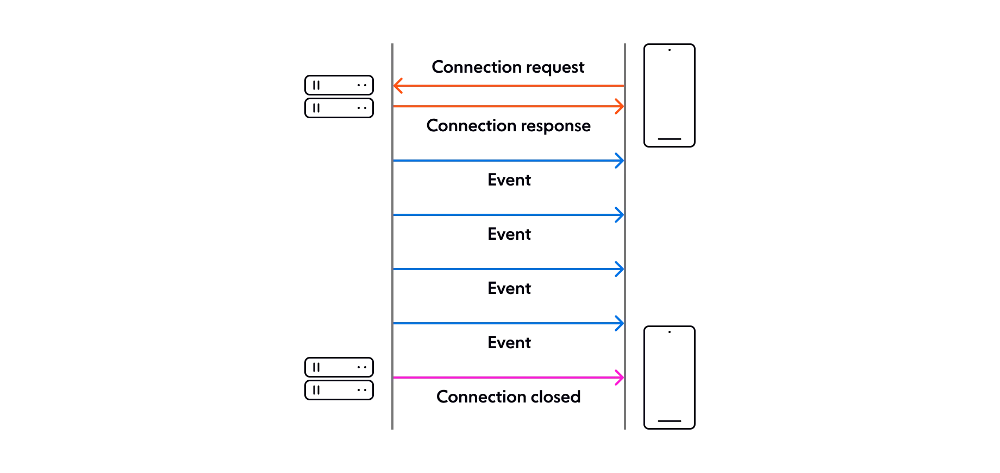
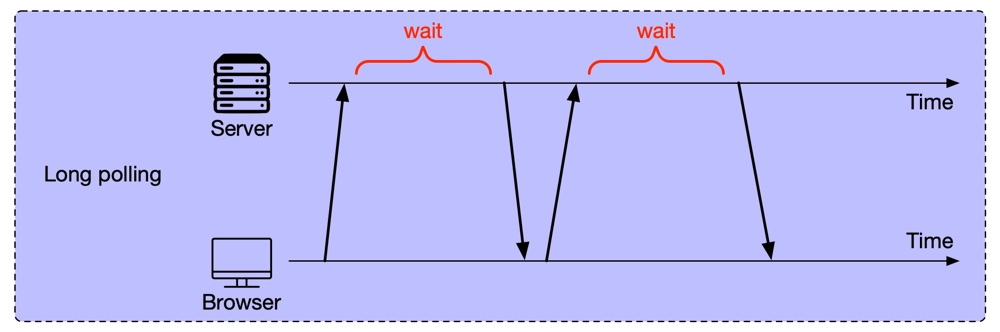

# Сетевые запросы

### 1. **Fetch**

Современный API для выполнения HTTP-запросов (GET, POST и т.д.).

**Как работает**: Возвращает Promise, через который можно получить ответ от сервера. Поддерживает JSON, текст, файлы и т.д.

**Плюсы и минусы**
\+ Нативная поддержка: встроен в браузеры, не нужно дополнительных библиотек.
\+ Поддерживает промисы
\+ не требует дополнительных зависимостей или увеличения размера приложения.
\+ Гибкость: Позволяет настраивать запросы с помощью объекта Request и обрабатывать различные типы ответов, такие как потоки, Blob, и JSON**.**
\- ошибки нужно обрабатывать вручную.
\- Меньше возможностей для настройки: Требует дополнительных шагов для более сложных сценариев, таких как настройка тайм-аутов или отмена запроса (нужно использовать AbortController).

**Особенности**: Простота, поддержка CORS, асинхронность.

```javascript
fetch('https://api.example.com/data')
.then(response => response.json())
.then(data => console.log(data))
.catch(error => console.error('Ошибка:', error));
```

### 2. **WebSocket**

Протокол для двустороннего обмена данными между клиентом и сервером в реальном времени.

  

**Как работает**: Устанавливает постоянное соединение, позволяя отправлять и получать сообщения без повторных запросов.

**Особенности**: Низкая задержка, идеально для чатов, игр, стриминга.

**Плюсы и минусы**
\+ Двусторонняя связь: клиент и сервер могут обмениваться данными в реальном времени.
\+ создает одно постоянное соединение и работает без необходимости устанавливать новое соединение для каждого сообщения, что снижает задержку и трафик.
\+ Подходит для приложений в реальном времени: чат-приложения, онлайн-игры, торговые платформы и т.д.
\- Сложность масштабирования: каждый клиент требует отдельного активного соединения. Для масштабирования используются прокси-сервисы, такие как Nginx.
\- Сложность работы с межсетевыми экранами и прокси: Некоторые брандмауэры и корпоративные прокси могут блокировать или ограничивать WebSocket соединения, поскольку они работают по нестандартным портам или используют нестандартные протоколы.
\- Отсутствие встроенных механизмов повторной попытки подключения
\- Дополнительная нагрузка на сервер
\- Сложность отладки и мониторинга
\- не предоставляет встроенных механизмов кэширования

```javascript
const ws = new WebSocket('ws://example.com/socket');
ws.onopen = () => console.log('Соединение установлено');
ws.onmessage = event => console.log('Получено:', event.data);
ws.onclose = () => console.log('Соединение закрыто');
```

### 3. **Server-Sent Events (SSE)**

Технология для односторонней передачи данных от сервера к клиенту по HTTP.

**Как работает**: Сервер отправляет текстовые сообщения (события) в формате text/event-stream. Клиент слушает их через EventSource.



**Особенности**: Простота, автоматическое восстановление соединения, подходит для уведомлений, лент.

**Плюсы и минусы:**
\+ Простота реализации: без дополнительных библиотек.
\+ идеален для случаев, когда необходимо только отправлять данные от сервера клиенту, например для обновлений новостей, спортивных результатов, данных с датчиков и т.д.
\+ автоматически переподключается при разрыве соединения.
\- поддерживает только отправку данных от сервера к клиенту, без возможности ответа
\- плохо поддерживается старыми браузерами
\- SSE использует HTTP, он подвержен ограничениям протокола HTTP
\- плохо масштабируется

```javascript
const source = new EventSource('https://example.com/events');
source.onmessage = event => console.log('Новое событие:', event.data);
source.onerror = () => console.log('Ошибка соединения');
```

### 4. **Long Polling**

Техника, где клиент отправляет запрос, а сервер "держит" его, пока не появятся новые данные или не истечет таймаут.

   

**Как работает**: После ответа сервер сразу получает новый запрос от клиента.

**Особенности**: Прост в реализации, но менее эффективен, чем WebSocket/SSE (больше накладных расходов).

**Плюсы и минусы:**
\+ Совместимость с существующими HTTP-протоколами: Long Polling работает на стандартных HTTP-запросах 
\+ Подходит для реального времени, не требуя постоянного открытия соединений, как WebSocket.
\- Нагрузка на сервер:  сервер вынужден удерживать множество соединений открытыми.
\- Большие задержки: если новых данных нет, клиент может ждать некоторое время, что увеличивает задержки получения информации.
\- Неэффективность: постоянные запросы создают нагрузку на сеть

```javascript
async function longPoll() {
  const response = await fetch('https://example.com/poll');
  const data = await response.json();
  console.log('Данные:', data);
  longPoll(); // Повторный запрос
}
longPoll();
```

### **AbortController**

API для отмены асинхронных операций, таких как fetch или другие задачи.

**Как работает**: Создает контроллер с сигналом (signal), который передается в запрос. Вызов abort() прерывает операцию.

* 1. Вы создаёте экземпляр AbortController.

* 2. Получаете его сигнал с помощью свойства signal и передаете этот сигнал в асинхронную операцию, такую как запрос через Fetch API.

* 3. Когда вам нужно отменить операцию, вы вызываете метод abort() у контроллера, что приводит к отмене всех связанных с этим сигналом операций.

```javascript
const controller = new AbortController();
const signal = controller.signal;

fetch('https://api.example.com/data', { signal })
  .then(response => response.json())
  .then(data => console.log(data))
  .catch(error => {
    if (error.name === 'AbortError') {
      console.log('Запрос отменен');
    } else {
      console.error('Ошибка:', error);
    }
  });

// Отмена запроса
controller.abort();
```

**Особенности**: Работает с fetch, не поддерживается в старых браузерах, полезно для таймаутов или отмены по действию пользователя.

### Когда что использовать:

* **Fetch**: Для разовых HTTP-запросов (REST API, загрузка данных).

* **WebSocket**: Для двустороннего обмена в реальном времени (чаты, игры).

* **SSE**: Для потоковых обновлений от сервера (уведомления, ленты).

* **Long Polling**: Когда WebSocket/SSE недоступны, но нужна имитация реального времени.

* **AbortController**: Для управления и отмены запросов, особенно в UI с частыми изменениями.