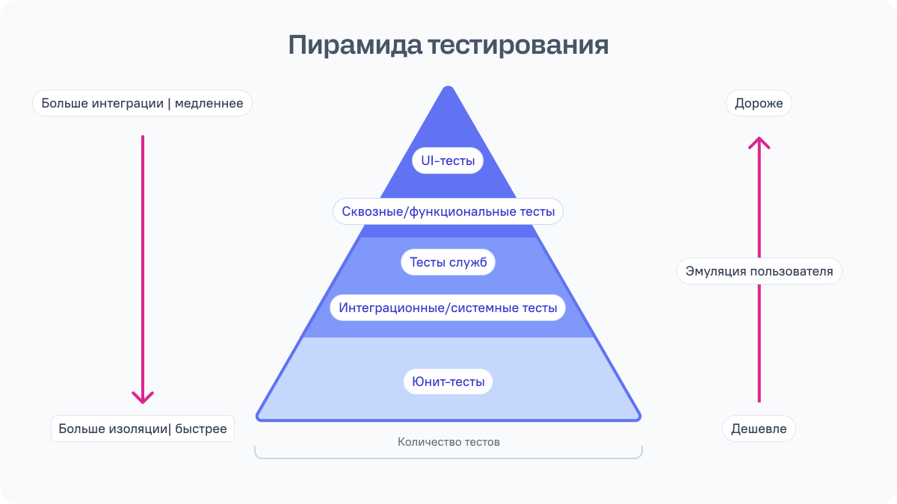
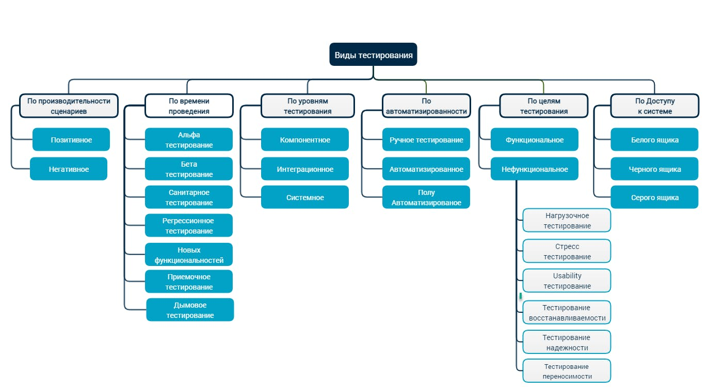

# Общие концепции

### Пирамида Тестирования

Это визуальная модель, показывающая оптимальное соотношение разных типов тестов:



* **Unit-тесты** быстрые (миллисекунды), дешевые в поддержке, легко найти проблему. Их должно быть больше всего.
* **Integration-тесты** проверяют взаимодействие нескольких модулей. Медленнее, сложнее отладить.
* **E2E-тесты** самые медленные (секунды/минуты), хрупкие, дорогие в поддержке. Покрывают только критичные сценарии.

---

### AAA паттерн (Arrange-Act-Assert)

Это подход к структурированию модульных (юнит) тестов, разделяющий их на три четких этапа. Он повышает читаемость, упрощает отладку и поддерживает независимость тестов, обеспечивая одинаковую структуру для всех сценариев.

```javascript
test('добавляет товар в корзину', () => {
  // Arrange (подготовка) - настраиваем начальное состояние
  const cart = new ShoppingCart();
  const product = { id: 1, name: 'Книга', price: 500 };

  // Act (действие) - выполняем тестируемое действие
  cart.addProduct(product);

  // Assert (проверка) - проверяем результат
  expect(cart.items).toHaveLength(1);
  expect(cart.total).toBe(500);
});
```

**Структура AAA:**

* **Arrange (Подготовка):** настройка тестовой среды — создание объектов, заглушек (stubs), моков (mocks), подготовка данных.
* **Act (Действие):** вызов тестируемого метода/функции.
* **Assert (Утверждение):** проверка результатов — сравнение ожидаемого результата с фактическим.

---

### TDD (Test-Driven Development)

Это методология разработки ПО, основанная на коротких циклах: сначала пишется тест, покрывающий новую функцию, затем пишется код, заставляющий тест пройти, и проводится рефакторинг. Этот подход обеспечивает создание надежного, чистого и покрытого тестами кода с самого начала.

**Основные этапы цикла TDD (Red-Green-Refactor):**

* **Красная зона (Red):** написание небольшого теста для новой функции, который сначала не проходит (падает), так как функционал еще не реализован.
* **Зеленая зона (Green):** написание минимального количества рабочего кода, чтобы тест прошел.
* **Рефакторинг (Refactor):** улучшение структуры, читаемости и качества кода без изменения его поведения, при этом тесты гарантируют безопасность изменений.

**Ключевые преимущества TDD:**

* Высокое качество кода: постоянное тестирование снижает вероятность ошибок.
* Понятная документация: тесты показывают, как код должен использоваться и работать.
* Безопасный рефакторинг: наличие тестов позволяет уверенно менять код, не боясь что-то сломать.

---

### Test Doubles (тестовые дублеры)

Заменители реальных зависимостей в тестах:

**1. Mock (мок)** — полная замена с контролем поведения:

```javascript
const apiMock = jest.fn().mockResolvedValue({ data: 'test' });
```

**2. Stub (заглушка)** — возвращает заранее определенные данные:

```javascript
const getUserStub = () => ({ id: 1, name: 'Test User' });
```

**3. Spy (шпион)** — отслеживает вызовы функции:

```javascript
const spy = jest.spyOn(console, 'log');
someFunction();
expect(spy).toHaveBeenCalledWith('Hello');
```

**4. Fake (подделка)** — упрощенная рабочая реализация:

```javascript
// Вместо реальной БД используем массив в памяти
const fakeDB = {
  data: [],
  save: (item) => fakeDB.data.push(item)
};
```

---

### CI/CD интеграция

Тесты должны запускаться автоматически:

* При каждом коммите
* Перед мерджем PR
* Перед деплоем в продакшн

Если тесты падают — деплой блокируется.

---

### Принципы хороших тестов (F.I.R.S.T.)

* **Fast** (быстрые) — тесты должны выполняться за миллисекунды
* **Independent** (независимые) — порядок выполнения не важен
* **Repeatable** (повторяемые) — одинаковый результат при каждом запуске
* **Self-validating** (самопроверяющиеся) — pass/fail без ручной проверки
* **Timely** (своевременные) — пишутся до или сразу после кода


